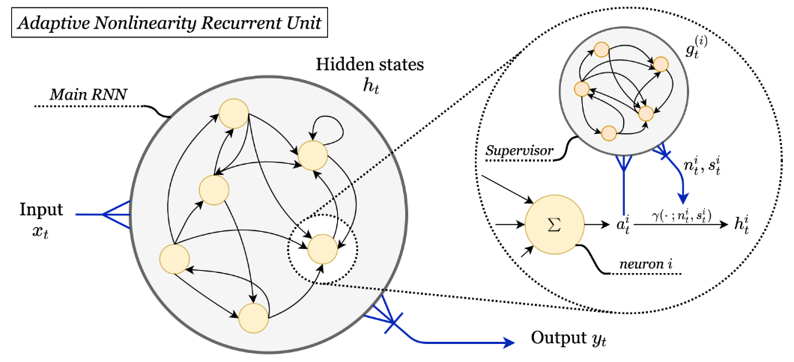

# Nonlinearity Adaptation & Modulation in RNNs

Accompanying code to [Advantages of biologically-inspired adaptive neural activation in RNNs during learning](https://arxiv.org/abs/2006.12253). In this repo, we introduce models for nonlinearity modulation alongside learning, and nonlinearity adaptation at inference time.

This work is centered around the activation function **gamma**, parametrised by a degree of neuronal gain *n* and degree of saturation *s*. Go to `/NetworkCreation/gamma_function.py` for a stand alone script of the function implemented for Pytorch.

Tasks based on code from [nnRNN](https://github.com/KyleGoyette/nnRNN).

<!---
## Contributions: models

1. Activation function *gamma*: To allow for its modulation on different timescales, we propose a novel, smooth two-parameter family of activation functions defined by

&space;=&space;(1-s)\frac{\log&space;(1&plus;&space;e^{n&space;x&space;})}{n}&space;&plus;&space;s\frac{e^{nx&space;}}{1&plus;e^{nx}})

acting on *x* with two parameters controlling its shape, the degree of saturation *s* and neuronal gain *n*.


2. *Adaptive Nonlinearity Recurrent Unit* 
{:height="50%" width="50%"}
--->

## Tasks

### Permuted Sequential MNIST (psMNIST)

Most up-to-date script, including implementation of the ANRU architecture along with baselines. Usage:
```
python3 sMNIST_task.py <args>
```
optional arguments:
  -h, --help            show this help message and exit
  -g, --cuda            Use CUDA
  -p, --permute         permute the order of sMNIST
  -v, --verbose         Print details
  --gain GAIN           degree of nonlinearity at initialization
  --saturation SATURATION
                        degree of saturation at initialization
  --random              random shape parameters initialization
  --learn_params        learn the shape parameters
  --nonlin {gamma,gamma2,ReLU}
                        Nonlinearity for RNN.
  --net-type {ANRU,RNN,LSTM,GRU}
                        Type of recurrent neural net.
  --nhid NHID           hidden size of recurrent net
  --lr LR               initial learning rate
  --save-freq SAVE_FREQ
                        frequency (in epochs) to save data
  --seed SEED           random seed for reproducibility
  --rinit RINIT         recurrent weight matrix initialization
  --iinit IINIT         input weight matrix initialization
  --batch BATCH         batch size
  --note NOTE           Any details to be entered manually upon launch
  --test                Test model, no training.
  --transform TRANSFORM
                        Transform to be applied on test set
  --transform-ratio TRANSFORM_RATIO
                        Ratio of dataset to apply sin transform on inputs.
```

### Character level prediction (PTB)

Character level prediction with the Penn-Tree Bank corpus.

usage:
```
python3 PTB_task.py <args>
```

Optional arguments:
```
  -h, --help            show this help message and exit
  --emsize EMSIZE       size of word embeddings
  --nhid NHID           number of hidden units per layer
  --capacity CAPACITY   unitary matrix capacity
  --epochs EPOCHS       upper epoch limit
  --batch_size N        batch size
  --bptt BPTT           sequence length
  --tied                tie the word embedding and softmax weights
  --seed SEED           random seed
  -g, --cuda            Use CUDA
  --log-interval N      report interval
  --save SAVE           path to save the final model
  --net-type NET_TYPE   rnn net type
  --lr LR
  --lr_orth LR_ORTH
  --rinit RINIT         recurrent weight matrix initialization
  --iinit IINIT         input weight matrix initialization
  --ostep_method OSTEP_METHOD
                        if learnable P, which way, exp or cayley
  --alam ALAM           alpha values lamda for ARORNN and ARORNN2
  --nonlin NONLIN       non linearity none, modrelu, relu, tanh, sigmoid
  --n N                 degree of nonlinearity
  --s S                 degree of saturation
  --save-freq SAVE_FREQ
                        frequency to save data
  -lp, --learn_params   learn the shape parameters
  --weight_decay WEIGHT_DECAY
  --alpha ALPHA
  --adam                Use adam
```
