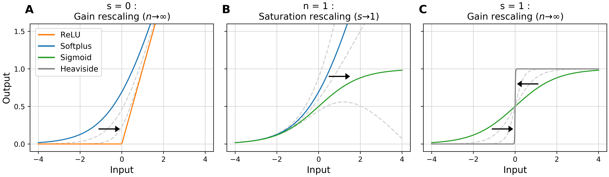

# Nonlinearity Adaptation & Modulation in RNNs

Accompanying code to [Neural networks with optimized single-neuron adaptation uncover biologically plausible regularization](https://www.biorxiv.org/content/10.1101/2022.04.29.489963v3). In this repo, we introduce models for nonlinearity modulation alongside learning, and nonlinearity adaptation at inference time.

This work is centered around the activation function **gamma**, a smooth two-parameter family of activation functions parametrised by a degree of neuronal gain *n* and degree of saturation *s*. Go to `/NetworkCreation/gamma_function.py` for a stand alone script of the function implemented for Pytorch.



Tasks based on code from [nnRNN](https://github.com/KyleGoyette/nnRNN).


## Training

We provide code for the **Permuted Sequential MNIST (psMNIST)** task, including implementation of the ANRU architecture along with baselines. Usage:
```
python3 sMNIST_task.py [args]
```
optional arguments:
```
  -h, --help            show this help message and exit
  -g, --cuda            Use CUDA
  -p, --permute         permute the order of sMNIST
  -v, --verbose         Print details
  --gain GAIN           degree of nonlinearity at initialization
  --saturation SATURATION
                        degree of saturation at initialization
  --random              random shape parameters initialization
  --learn_params        learn the shape parameters
  --nonlin {gamma,gamma2,ReLU}
                        Nonlinearity for RNN.
  --net-type {ANRU,RNN,LSTM,GRU}
                        Type of recurrent neural net.
  --nhid NHID           hidden size of recurrent net
  --lr LR               initial learning rate
  --save-freq SAVE_FREQ
                        frequency (in epochs) to save data
  --seed SEED           random seed for reproducibility
  --rinit RINIT         recurrent weight matrix initialization
  --iinit IINIT         input weight matrix initialization
  --batch BATCH         batch size
  --note NOTE           Any details to be entered manually upon launch
  --test                Test model, no training.
  --transform TRANSFORM
                        Transform to be applied on test set
  --transform-ratio TRANSFORM_RATIO
                        Ratio of dataset to apply sin transform on inputs.
```

## Postprocessing

We include in the `Postprocessing` folder various files to analyze and plot results from trained models. In the folder `Postprocessing/FigureGeneration/`, one can find the necessary code to reproduce the figures. As for post-processing metrics, we provide the following:
 
- Lyapunov Exponents : Relevant code can be found in `Postprocessing/LEs.py`, specifically the method `calculateLEs`. 
- Fractional differentiation : The method `frac_diff` in `Postprocessing/FigureGeneration/figuregeneration_defs.py` can be used to calculate the fractional order derivative of a single scalar signal. For its use to determine the fractional order of the neural activity signal, as outline in the Methods section of the paper, we refer to the accompanying code in `Postprocessing/FigureGeneration/appendix_fracdiff.py`.  